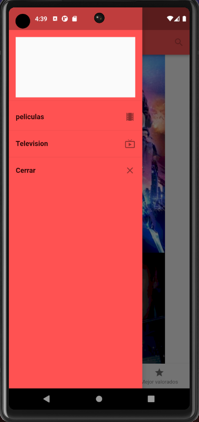
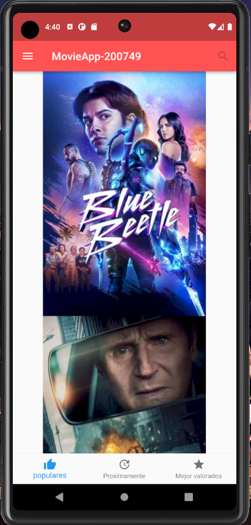

# DMI_PRACTICA7_200749

  
# Universidad Tecnológica de Xicotepec de Juárez

## Ingeniería en Desarrollo y Gestión de Software

## Desarrollo Movil Integral

## Marco Antonio Rosas Gonzalez
 
## 10° "A"

## Septiempre - Diciembre

## Descripción: "MovieAPP", la aplicación definitiva que te brinda acceso directo al emocionante universo del cine y la televisión, todo desde la comodidad de tu dispositivo móvil. Gracias a su plataforma sólida, desarrollada en Flutter, esta aplicación te permite explorar un extenso catálogo en constante expansión de películas, series y contenido audiovisual de alta calidad. Con "MovieAPP," puedes sumergirte en experiencias completas, accediendo a información detallada sobre cada título y sus fechas de lanzamiento. Además, disfruta de una integración fluida con tus servicios de transmisión preferidos, permitiéndote ver películas y episodios directamente desde la aplicación. Ya seas un apasionado del cine o un fanático de las series, "MovieAPP" te brinda una experiencia personalizada al permitirte crear y administrar listas de reproducción adaptadas a tus preferencias. Su interfaz de usuario elegante y fácil navegación garantiza una experiencia intuitiva y gratificante. En resumen, "MovieAPP" se convierte en tu compañero esencial para explorar, descubrir y disfrutar del fascinante mundo del entretenimiento audiovisual.

&nbsp;
&nbsp;

&nbsp;
&nbsp;

 
 
